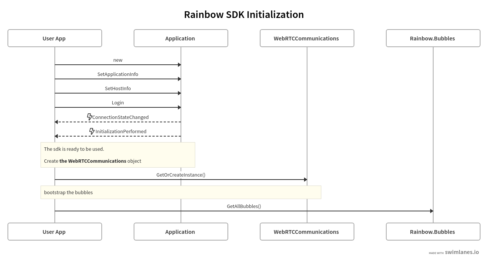
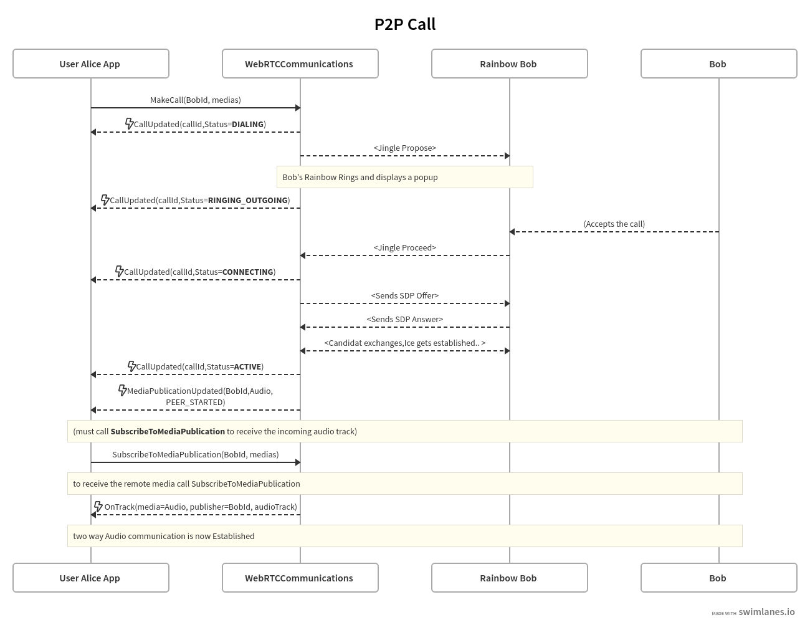
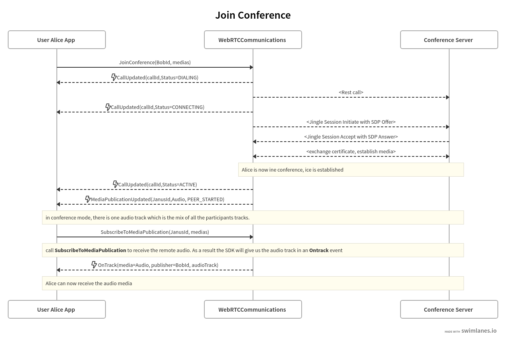
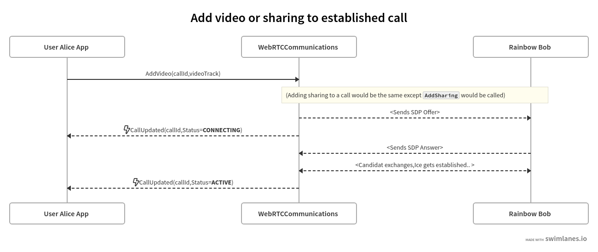
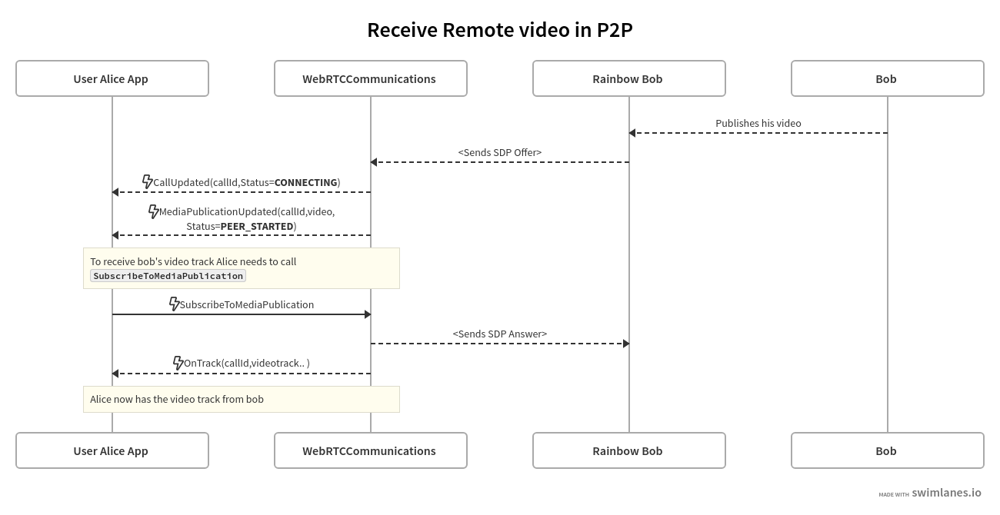

# Developping with the **Rainbow.WebRTC SDK**

This page gives a quick overview on how to use the Rainbow.WebRTC sdk help develop a webrtc enabled  application.

It is intended to be about general principles and is not unity specific.

For specifics of the Rainbow WebRTC Unity package please refer to [this page](developing_unity.md).


## Instantiation 

+ Create a `Rainbow.Application object`
```
Rainbow Application myApp = new Rainbow.Application();
```

+ Configure application credentials and platform

+ Enable restrictions on Conferences
+ Monitor ConnectionStateChanged and InitializationPerformed 
+ Call Login()
The SDK will try to connect to the platform using the supplied (application and user) credentials. 
If it failed you are informed in the optional callback. 

When it's done initializing and retrieving informations it will raise the InitializationPerformed signal.

At this stage the SDK can be used. 
If your application makes use of bubbles or conferences, when InitializationPerformed is received it should call Bubbles.GetAllBubbles().
It is the right time to instantiate a WebRTCCommunications object, which will make it possible make calls or join conference.

You can find more informations about the Rainbow SDK [Here](https://developers.openrainbow.com/doc/sdk/csharp/core/lts/guides/001_getting_started).

This quick diagram summarizes how to initialize an application who would use WebRTCCommunications.


## Events in WebRTCCommunications
The most importants events to handle to issue webrtc calls in your applications are **CallUpdated** , **MediaPublicationUpdated** and **OnTrack**.

When a user receives a call, or is issuing the call,  the WebRTCCommunications class informs him of the progression of the call using the **CallUpdated** events.

The event provides you with an instance of the [**Call** class](https://developers.openrainbow.com/doc/sdk/csharp/core/sts/api/Rainbow.Model.Call), containing many
useful information like
+ The status 
+ The local and remote medias established on the call
+ The participants
+ The call Id which is needed to perform actions on this calls, like decline the call, hangup, publish some medias.. 

The other important event to handle is MediaPublicationUpdated. This happens each time a local or remote media is added to the call.
A MediaPublicationUpdated event provides a [**MediaPublication**](https://developers.openrainbow.com/doc/sdk/csharp/core/sts/api/Rainbow.Model.MediaPublication) object which
can be used to subscribe to a MediaPublication using the method [WebRTCCommunications.SubscribeToMediaPublication](https://developers.openrainbow.com/doc/sdk/csharp/webrtc/sts/api/Rainbow.WebRTC.WebRTCCommunications#Rainbow.WebRTC.WebRTCCommunications.SubscribeToMediaPublication(Rainbow.Model.MediaPublication-_Action-Rainbow.SdkResult-Boolean--)).

Calling this method means that your application is interested in this media. 

If you subscribe to a media publication WebRTCommunications will send you the associated MediaStreamTrack using  **OnTrack** event.
## Making Calls and Receiving Calls

Here is a simplified (and incomplete) diagram showing how to use WebRTCCommunications events and methods to establish an audio Peer to peer call, using the [MakeCall](https://developers.openrainbow.com/doc/sdk/csharp/webrtc/sts/api/Rainbow.WebRTC.WebRTCCommunications#Rainbow.WebRTC.WebRTCCommunications.MakeCall(String-_Dictionary-Int32-_Rainbow.Medias.IMedia--_String-_Action-Rainbow.SdkResult-String--)) method.




When another user calls your application, WebRTCCommunications emits a CallUpdated with a CallStatus of RINGING_INCOMING .
To accept the call use [**WebRTCCommunications.AnswerCall**](https://developers.openrainbow.net/doc/sdk/csharp/webrtc/sts/api/Rainbow.WebRTC.WebRTCCommunications#Rainbow.WebRTC.WebRTCCommunications.AnswerCall(String-_Dictionary-Int32-_Rainbow.Medias.IMedia-)), and to decline use [**WebRTCCommunications.RejectCall**](https://developers.openrainbow.net/doc/sdk/csharp/webrtc/sts/api/Rainbow.WebRTC.WebRTCCommunications#Rainbow.WebRTC.WebRTCCommunications.RejectCall(String)). 

What happens after AnswerCall is similar to what happens after MakeCall.


## Joining Conferences
Here is a simplified (and incomplete) diagram showing how to use WebRTCCommunications events and methods to join and establish the audio in a conference, using the [**JoinConference**](https://developers.openrainbow.com/doc/sdk/csharp/webrtc/sts/api/Rainbow.WebRTC.WebRTCCommunications#Rainbow.WebRTC.WebRTCCommunications.JoinConference(String-_Dictionary-Int32-_Rainbow.Medias.IMedia--_Action-Rainbow.SdkResult-String--)) method.



## Adding Medias
Once the P2P (or Conference) call is established, the [**AddVideo**](https://developers.openrainbow.com/doc/sdk/csharp/webrtc/sts/api/Rainbow.WebRTC.WebRTCCommunications#Rainbow.WebRTC.WebRTCCommunications.AddVideo(String-_Rainbow.Medias.IMedia)) and [**AddSharing**](https://developers.openrainbow.com/doc/sdk/csharp/webrtc/sts/api/Rainbow.WebRTC.WebRTCCommunications#Rainbow.WebRTC.WebRTCCommunications.AddSharing(String-_Rainbow.Medias.IMedia)) methods to publish video tracks on the **Video** or  **Sharing** channel.

This diagram shows how to do this.



## Receiving Video Medias
Every participant of a call are likely to publish video or sharing. So far we've uncovered how to send a video stream, now it's time to consider receiving video streams.

Each time a video media is published by one of the other participants of the call, WebRTCCommunication will send a [**MediaPublicationUpdated**](https://developers.openrainbow.com/doc/sdk/csharp/webrtc/sts/api/Rainbow.WebRTC.WebRTCCommunications#Rainbow.WebRTC.WebRTCCommunications.OnMediaPublicationUpdated) event. 
If your application needs to handle this stream it will have to call [**SubscribeToMediaPublication**](https://developers.openrainbow.com/doc/sdk/csharp/webrtc/sts/api/Rainbow.WebRTC.WebRTCCommunications#Rainbow.WebRTC.WebRTCCommunications.SubscribeToMediaPublication(Rainbow.Model.MediaPublication-_Action-Rainbow.SdkResult-Boolean--)).

As a result WebRTCCommunication will send an **OnTrack** event providing you with the video track.

This simplified diagram summarises it:


| |
| ----------- |  
|[Back to `Index`](../index.md)|
|[Back to `Install`](install.md)|
|[Back to `Sample`](sample.md)|
|[Go to `Rainbow WebRTC Unity Specifics`](developing_unity.md)|

