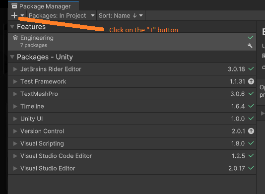
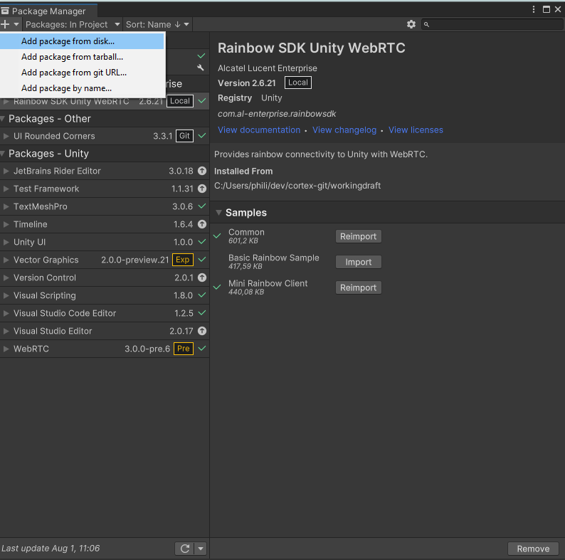

# Install package from the cloned repository :

Select `Window/Package Manager` in the menu bar.

Check Package Manager window, Click `+` button.

Select `Add package from Disk`

Browse to the package.json file and click on open.

Click on `Add`.

Optionnally import the sample scenes:

check [the samples page](samples.md) to learn more about this.

| |
| ----------- |  
|[Back to `Index`](../index.md)|
|[Go to `Sample`](sample.md)|
|[Go to `Develop with Rainbow WebRTC`](developing_general.md)|
|[Go to `Rainbow WebRTC Unity Specifics`](developing_unity.md)|
