# Configure and start the Basic Rainbow Sample:
From the `package manager`, click on the `Rainbow SDK Unity WebRTC` and unfold the `Samples`.
Import `Common`, and `Basic Rainbow Sample`.

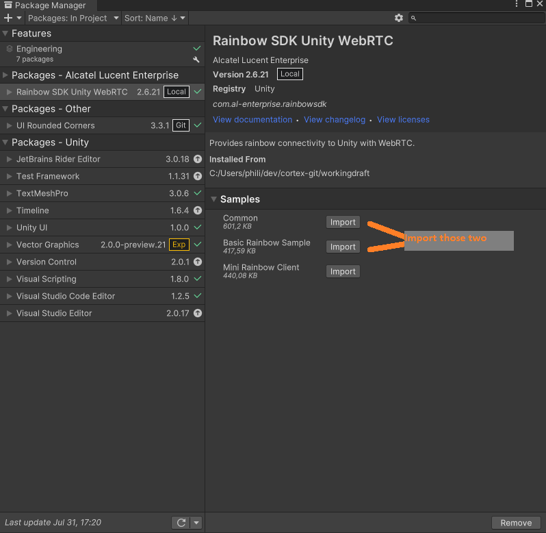

# Configure and start the Basic Rainbow Sample:

From your `project` view unfold the  `Basic Rainbow Sample`, go to `Scenes` and double click on the `BasicRainbowSampleScene` scene.

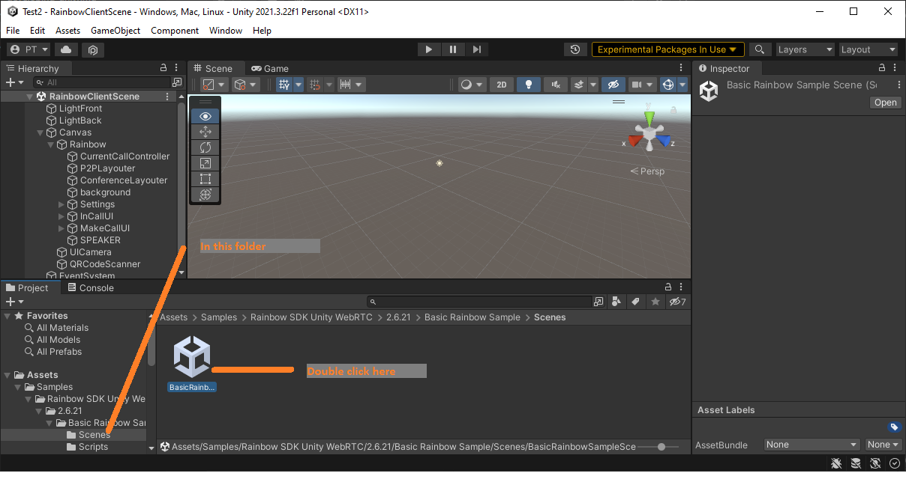
 
If TextMesh Pro is not already in use in your project you will be prompted to import the TMP. 
Click on the first button `Import TMP Essentials`, then close the window.

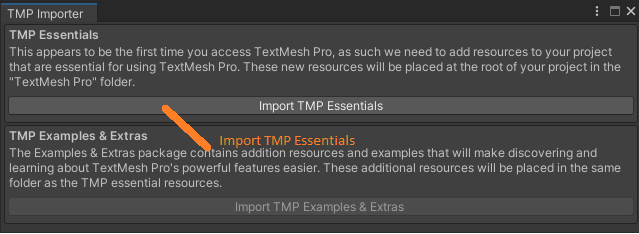

In the `hierarchy` view, unfold the `Rainbow` tree, select the `RainbowController` game object, and in the inspector specify the rainbow related parameters:
+ `APP_ID` and `APP_SECRET_KEY`
Those are the application credentials you received when you created your rainbow application from the [Rainbow Developer Site](https://developers.openrainbow.com).

+ `HOSTNAME`
This is the rainbow platform on which your application and user was created.
If you are using the sandbox, use `sandbox.openrainbow.com`, else use `openrainbow.com`.

+ `LOGIN_USER1` and `PASSWORD_USER1`
Those are the credentials of the user.

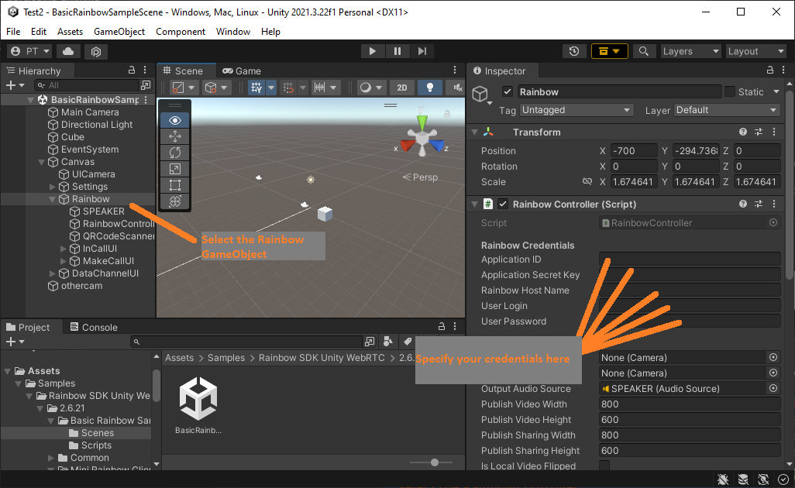

Enter Play mode. You should see a simple ui containing 3 dropdown:

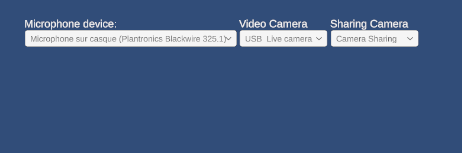

And after a short while, the sdk should be connected to rainbow, and two additional drop downs and buttons will show up.

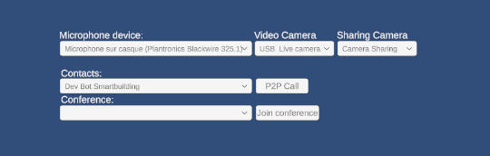

The first row contains three dropdown in which you can specify which device the sdk will use 
+ as a microphone.
+ as a webcam when required to publish on the 'Video' channel. It can be either a unity camera, or a physical device web cam.
+ as a video stream when required to publish on the 'Sharing' channel. It can be either a unity camera, or a physical device web cam.
If you intend to publish on both sharing and camera channel, the `video camera` and `sharing camera` must be different.

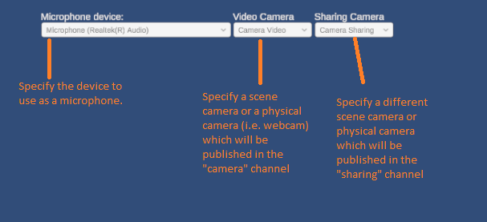

It can also be convenient to use an audio clip as a `Microphone device`.
To do so, before entering Play mode, unfold `Canvas/Settings` and in the component `SettingsUI` specify a reference to this Audio Clip in the parameter `Audio Clip`.
Afterwards, the `Microphone Device` drop down will contain an option to use your clip.

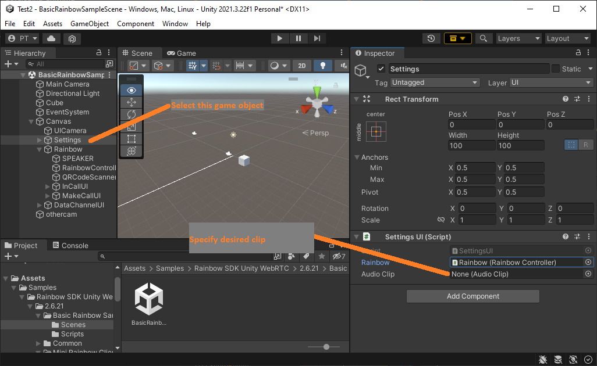

Now that the SDK is connected to rainbow, it is possible to issue a  direct (P2P) call to one of your contacts, or to join an active conference.
If your user doesn't have contacts or is not part of a conference yet, use another user and the rainbow client to invite him as a contact and invite him in some bubble,
then use the rainbow client with your user's credentials to accept the invitations.

To issue a P2P call to a contact, select the desired contact in the `Contacts` dropdown, and click on `P2P Call`.

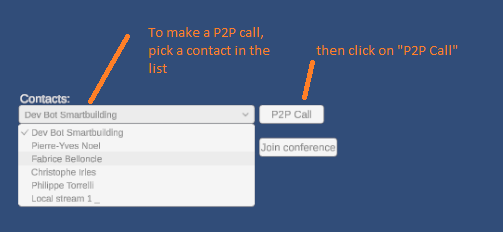

To join an active conference, select the conference in the dropdown, and click on `Join Conference`.
If no one has started the conference, no conference will show in this list.

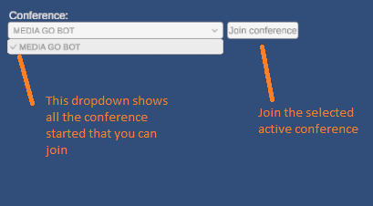

Once the call is established, the `Join conference` and `P2P Call` rows will be hidden, and a new row displays buttons to Start or Stop local video or Sharing, and hangup the call.

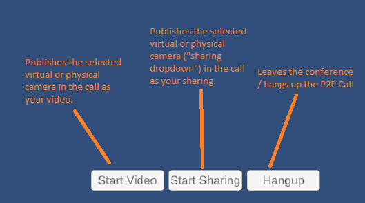

| |
| ----------- |  
|[Back to `Index`](../index.md)|
|[Back to `Install`](install.md)|
|[Go to `Develop with Rainbow WebRTC`](developing_general.md)|
|[Go to `Rainbow WebRTC Unity Specifics`](developing_unity.md)|
